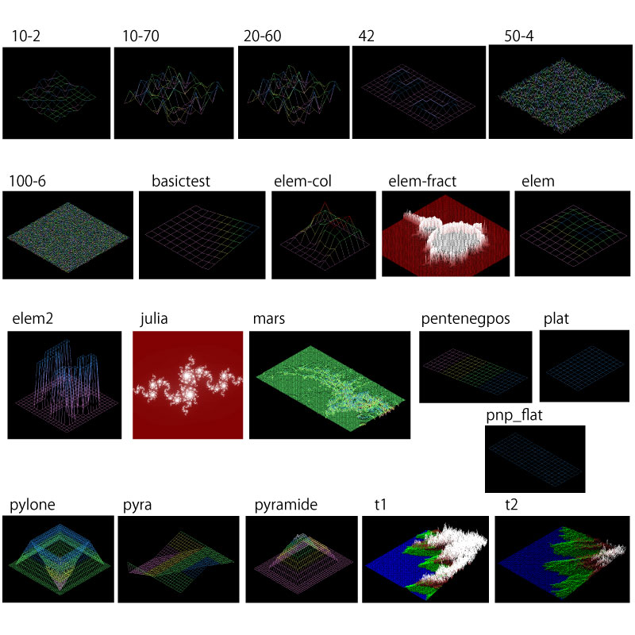

# FdF
FdF : short for "fil de fer" in French = "wireframe model"


<br>

Linux
```
$ make clone
$ make
$ ./fdf test_maps/42.fdf
```

<br>

External functions
- open, close, read, write
- malloc, free, strerror, exit
- math library
- [minilibx](https://github.com/42Paris/minilibx-linux)

<br>

## test_maps
